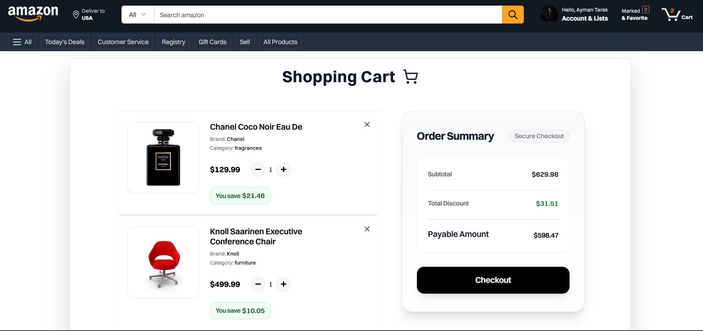
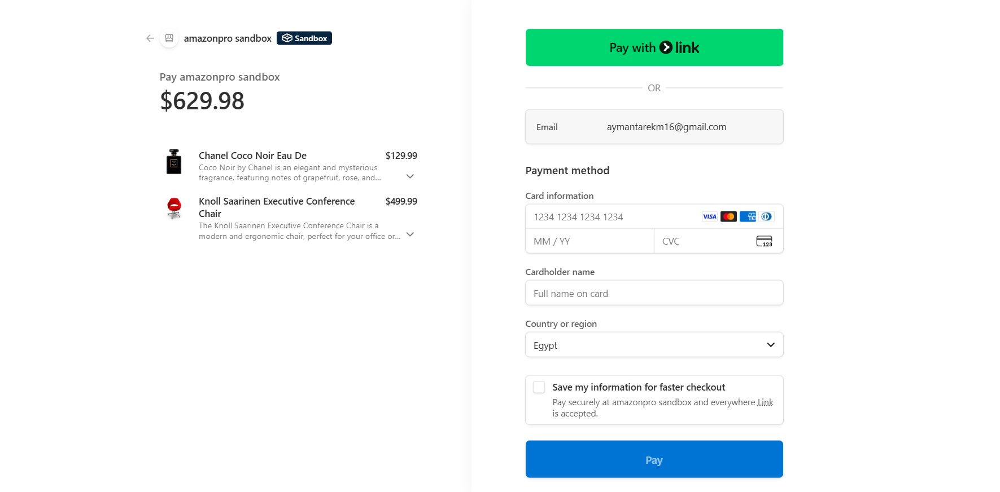
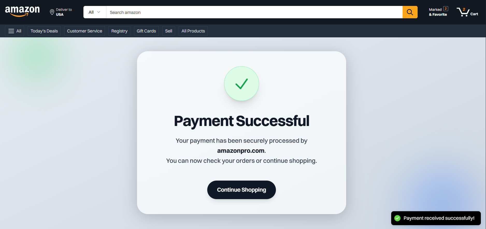

<div align="center">
  

# 🛒 Amazon Clone  
A fully-featured and modern e-commerce web application inspired by Amazon, built using **Next.js 15**, **Firebase**, **Stripe**, and a beautifully crafted UI powered by **Tailwind CSS**.

</div>

---

## 🚀 Overview

This project is a production-ready **Amazon-style online shopping experience**, designed to demonstrate advanced front-end engineering skills, real-time integrations, and high-quality UI/UX patterns used by top global companies.

It simulates the core e-commerce flow:
- Browsing products  
- Adding items to a cart  
- Managing global state  
- Handling authentication  
- Processing real payments using Stripe Webhooks  
- Storing orders in Firebase  

Everything is built with a clean, scalable, and modern architecture that follows **industry best practices**.

---

## ✨ Features

### 🛍️ E-Commerce Essentials
- Elegant homepage with animated hero sections  
- Dynamic product listings  
- Product add/remove logic with persistent cart  
- Real-time price updates  

### 🔐 Authentication
- Firebase Authentication (Google login)

### 💳 Payment Integration
- Stripe Checkout  
- Secure Webhooks  

### 🗂️ State Management
- Global cart handling using **Zustand**

### ⚡ Performance & UX
- Blazing-fast rendering using Next.js App Router  
- Framer Motion animations  
- Toast notifications  
- Fully responsive & mobile-first  

---

## 🛠️ Tech Stack

### **Frontend**
| Tech | Purpose |
|------|---------|
| ⚛️ **Next.js 15.2.3** | App Router, SSR/SSG, routing |
| 🎨 **Tailwind CSS** | Utility-first styling |
| 🎞️ **Framer Motion** | Smooth animations |
| 🔥 **Firebase** | Auth + Firestore |
| 🪝 **React Firebase Hooks** | Real-time Firebase data |
| 🧂 **Zustand** | Lightweight state management |
| 🍞 **React Hot Toast** | Notifications |
| 🎬 **Tailwindcss Animate** | Pre-built CSS animations |
| 💳 **Stripe** | Payments + Webhooks |
| 🔗 **Lucide React / React Icons** | Iconography |

---

## 📸 Screenshots

> All screenshots are located in:  
`public/images/`

<div align="center">

### 🏠 Home Page


### 🛒 Cart


### 💳 Checkout


### 📦 Succsess Page


</div>


## ⚙️ Installation & Setup

### 1️⃣ Clone the repository
```bash
git clone https://github.com/your-username/amazon-clone.git
cd amazon-clone
```

### 2️⃣ Install dependencies
```bash
npm install
```

### 3️⃣ Environment variables

Create a `.env.local` file:

```
FIREBASE_API_KEY=xxxxx
STRIPE_SECRET_KEY=xxxxx
NEXT_PUBLIC_STRIPE_KEY=xxxxx
STRIPE_WEBHOOK_SECRET=xxxxx
```

### 4️⃣ Run development server
```bash
npm run dev
```

### 5️⃣ Open browser
```
http://localhost:3000
```

---

## 🧱 Architecture

This project follows a modular architecture:

- **App Router Based Layouts**  
- **Component-Driven UI**  
- **Custom Hooks** (Firebase, Stripe, Zustand logic)  
- **Stateless UI + Centralized State**  
- **Webhook Server Handling** using Next.js Route Handlers  
- **Clean Folder Structure for Future Scalability**

---

## 🚀 Deployment

The app can be deployed easily using:

### ▶️ Vercel (Recommended)
- Zero-config deployment  
- Native Next.js optimization  

### ▶️ Alternative Providers
- Netlify  
- Firebase Hosting  
- Render  

---

## 🤝 Contributing
Contributions, issues, and feature requests are welcome!

---

## 📬 Contact

**Ayman Tarek** – Front-End Developer  
📧 Email: aymanttarekm16@gmail.com
🔗 Portfolio:[ https://your-portfolio.com  ](https://react-portfolio-six-green.vercel.app/)
🐙 GitHub: https://github.com/aymantarek16

---

<div align="center">

### ⭐ If you like this project, don't forget to give it a star!

</div>
